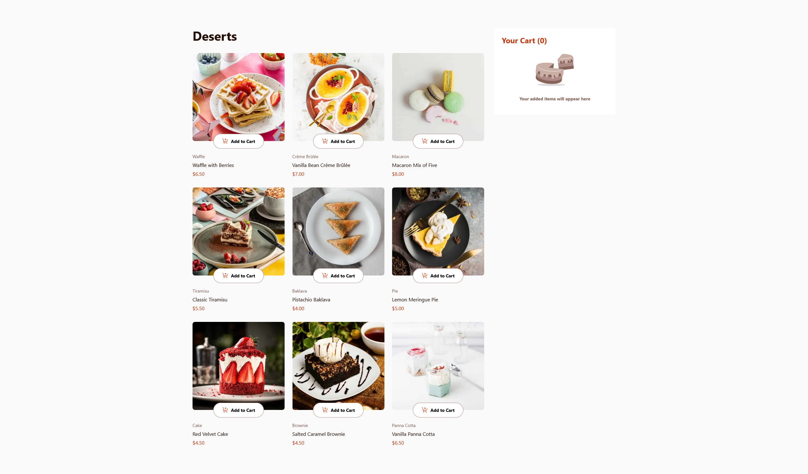
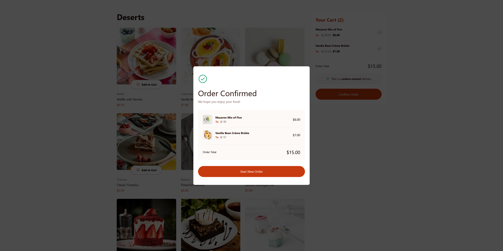

# Frontend Mentor - Product list with cart solution

This is a solution to the [Product list with cart challenge on Frontend Mentor](https://www.frontendmentor.io/challenges/product-list-with-cart-5MmqLVAp_d). Frontend Mentor challenges help you improve your coding skills by building realistic projects.

## Table of contents

- [Overview](#overview)
  - [The challenge](#the-challenge)
  - [Screenshot](#screenshot)
  - [Links](#links)
- [My process](#my-process)
  - [Built with](#built-with)
  - [Continued development](#continued-development)
  - [Useful resources](#useful-resources)
  - [AI Collaboration](#ai-collaboration)
- [Author](#author)

## Overview

### The challenge

Users should be able to:

- Add items to the cart and remove them
- Increase/decrease the number of items in the cart
- See an order confirmation modal when they click "Confirm Order"
- Reset their selections when they click "Start New Order"
- View the optimal layout for the interface depending on their device's screen size
- See hover and focus states for all interactive elements on the page

### Screenshot

### Links

- Solution URL: [GitHub](https://github.com/GFJankavs/fm-product-list-with-cart)
- Live Site URL: [Website](https://peqcjd954ln1xmxu1no86t9y.gfjankavs.lv/)

## My process

### Built with

- Semantic HTML5 markup
- CSS custom properties
- Flexbox
- CSS Grid
- Mobile-first workflow
- [React](https://reactjs.org/) - JS library
- [Next.js](https://nextjs.org/) - React framework
- [Tailwind CSS](https://styled-components.com/) - For styles

### Continued development

I would like to improve more on responsive design and to properly implement states for different interactive elements in the document.

### Useful resources

- [NextJS Documentation](https://nextjs.org/docs/app/api-reference/file-conventions/metadata/app-icons) - This helped me understand how to get the right favicon showing.

### AI Collaboration

- What tools did you use (e.g., ChatGPT, Claude, GitHub Copilot)?
  - Used Claude Code
- How did you use them (e.g., debugging, generating boilerplate, brainstorming solutions)?
  - Helping to get favicon for this NextJS project

## Author

- Frontend Mentor - [@yourusername](https://www.frontendmentor.io/profile/GFJankavs)
- Twitter - [@yourusername](https://www.twitter.com/GFJankavs)
